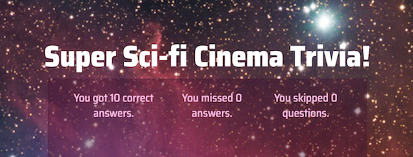

<h1 align="center">TriviaGame: Sci-Fi Cinema Edition</h1>

  Test your knowledge of sci-fi cinema with my JavaScript &amp; jQuery game!

## Technologies Used
JavaScript, jQuery, CSS, Bootstrap CSS, HTML

### Deployed Link
[GitHub] https://g33klaura.github.io/TriviaGame/

### Key Features
* Countdown timer
* Form with radio buttons
* Responsive design

### Screenshots

<h6>After submitting, the total number of correctly guessed, skipped, or wrong answers will display.</h6>

### Process of the Game

* First screen shows start button to start game

* One question with 4 possible answers shows with timer for each question

* After answer selection, screen shows either correct, incorrect, or time out

* After a few seconds, next question loads with new timer and 4 new answers

* Repeats until number of questions is over

* Ending screen will tally number of correct, incorrect, or skipped questions
